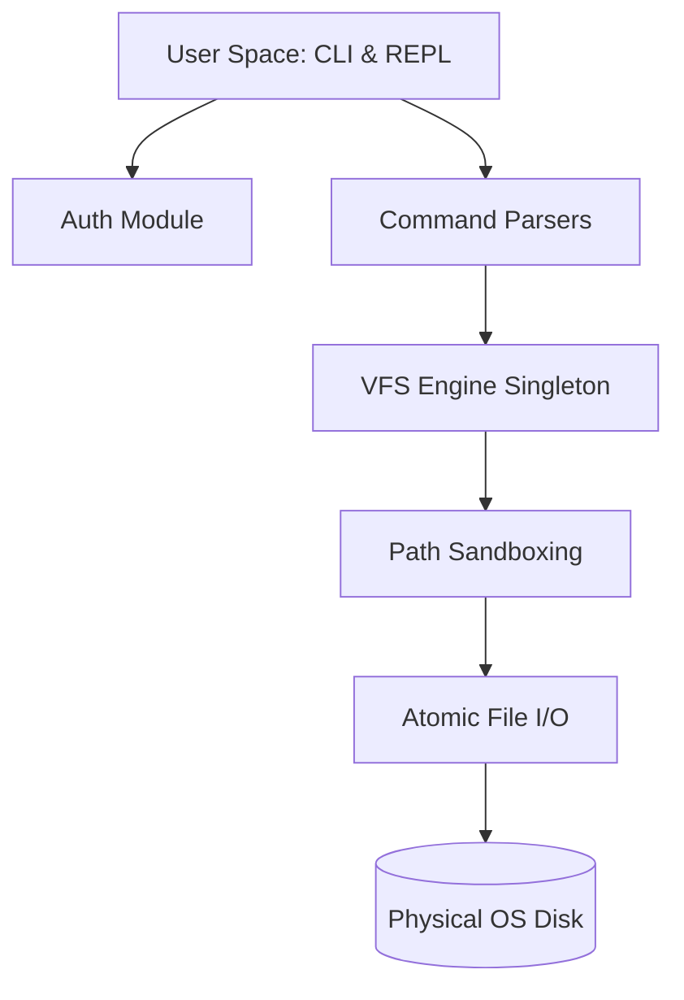

<div align="center">
  
  <h1>Brsh (Virtual OS & CLI Emulator)</h1>
  <p><em>An educational Terminal and Virtual File System (VFS) emulator focused on OS architecture.</em></p>

  <a href="https://nodejs.org">
    
  </a>
  <a href="https://www.typescriptlang.org/">
    
  </a>
  <a href="https://github.com/LDrawe/brsh/actions/workflows/ci.yml">
    
  </a>
  <br />
  <br />
</div>

**Brsh** is a TypeScript-based educational project that emulates the core principles of a real Operating System. It implements an in-memory nested inode tree, two-way synchronization with the physical disk, and strict directory sandboxing, all exposed through a fully localized Brazilian Portuguese (PT-BR) CLI.

---

## 📝 Features

- **PT-BR Interface**: Full command suite built specifically for Brazilian Portuguese speakers (`listar`, `carq`, `apagar`, `renomear`).
- 🗂️ **Virtual File System (VFS)**: An in-memory object-oriented nested tree (`IVfsNode`) that syncs automatically with the physical disk.
- 🔁 **2-Way Sync (Smart Boot)**: Recovers physically deleted files based on memory state, and pulls physical files into the VFS on boot.
- 🛡️ **Kernel Sandboxing**: Anti-Directory-Traversal protection. It creates a *chroot jail* model that prevents users from escaping their `/home` environment.
- ⚛️ **Atomic I/O Operations**: Implements atomic writing strategies (temp-to-rename) to prevent tree corruption during sudden process terminations.
- 🛑 **POSIX-Compliant Signaling**: Graceful exit handling for `SIGINT` (Ctrl+C) and `EOF` (Ctrl+D), mimicking authentic Linux bash behavior.
- ⚡ **Zero-Overhead Runtime**: Built to run natively on `Node.js` (using Type Stripping) or fast runtimes like `Bun` and `Deno`.

---

## 🏗️ Architecture

The codebase applies solid design patterns (Command Pattern, Singletons) and strictly separates Kernel space from User space:



- 📂 `src/cli/` — User space (REPL loop, UI, and Command Pattern implementation).
- 📂 `src/config/` — Static database (Source of Truth) and user credentials.
- 📂 `src/core/` — Kernel space (Sandboxing, VFS state, and atomic I/O).

---

## 💻 Commands

**Brsh** supports a complete ecosystem for file management.

### Directory Navigation
| Command | Parameters | Description |
| :--- | :--- | :--- |
| `cdir` | `<name>` | Creates a new directory. |
| `rdir` | `<name>` | Removes a directory (only if empty). |
| `mudar` | `<path>` | Changes the current working directory. |
| `atual` | - | Prints the absolute path of the current directory. |
| `listar` | - | Lists files and subfolders in alphabetical order. |
| `listarinv` | - | Lists files and subfolders in reverse alphabetical order. |
| `listartudo`| - | Recursively lists the entire directory tree. |

### File Operations
| Command | Parameters | Description |
| :--- | :--- | :--- |
| `carq` | `<name>` | Creates an empty file (`touch`). |
| `apagar` | `<target>` | Recursively deletes a file or directory (`rm -rf`).|
| `copiar` | `<src>` `<dst>`| Copies a file/folder, assigning new virtual IDs. |
| `mover` | `<src>` `<dst>`| Moves a file/folder. |
| `renomear`| `<old>` `<new>`| Renames a file/folder in the same directory. |
| `buscar` | `<name>` | Deep search (DFS) for a file. |
| `listaratr`| `<target>` | Shows disk attributes and creation date. |

### System Utilities
| Command | Parameters | Description |
| :--- | :--- | :--- |
| `alterarusr`| `<login>` | Switches user sessions. |
| `deletarusr`| `<login>` | Deletes a user environment and revokes access. |
| `resetar` | - | Formats the VFS, wiping the disk and rebuilding the system. |
| `clear` | - | Clears the terminal screen. |
| `quit` | - | Exits the shell cleanly. |

---

## 🚀 Getting Started

### 1. Prerequisites
- **Node.js** (v24+) or **Bun** (v1.x)
- **Git**

### 2. Running the Project
```bash
git clone https://github.com/LDrawe/brsh.git
cd brsh

npm install
npm start
```

---

## 🧪 Testing
The architecture features **100% test coverage**, continuously validating concurrency and Path Traversal Exploits.

```bash
npm test
```